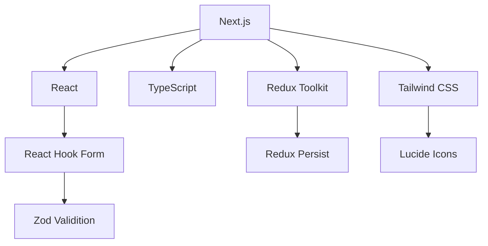

# Tasks Manager App

A modern task management application built with Next.js, TypeScript, Redux Toolkit, and Tailwind CSS.

## Features

- 📝 Task creation, editing, and deletion
- ✅ Mark tasks as complete/incomplete
- 🔍 Search and filter tasks
- 📅 Sort by due date (ascending/descending)
- 🏷️ Categorize tasks with color coding
- 📊 Pagination for large task lists
- 🌓 Dark/Light mode toggle
- 📱 Fully responsive design

## Technologies



```
# Clone the repository
git clone https://github.com/rboutaik/tasks-manager.git

# Navigate to project directory
cd tasks-manager

# Install dependencies
npm install

# Start development server
npm run dev
```

```text
todo_app/
├── components/       # Reusable components
│   ├── navBar.tsx
│   └── sideBar.tsx
│   └── tasksForm.tsx
│   └── tasksList.tsx
│   └── themeToggle.tsx
├── lib/              # State management
│   ├── redux/
│   |   ├── store.ts
│   └── types.ts
└── app/            # Next.js pages
    ├── layout.tsx
    └── page.tsx
    └── globals.css
└── 
```
